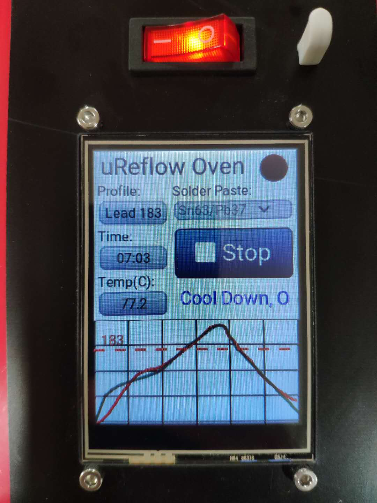
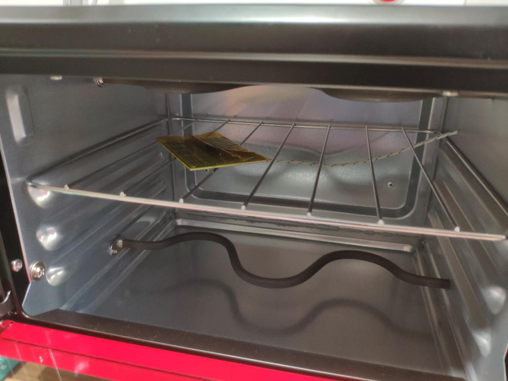

## μReflow Oven with MicroPython & LittlevGL

[中文版请见于此](./readme_zh.md)。

Updated! Now the μReflow Oven is PID control enabled!



For previous version which is non-PID controlled, pls see the branch ```Adafruit-EZ-Make-Oven-alike```.

This project is an improved and heavily modified version of [Adafruit EZ Make Oven](https://learn.adafruit.com/ez-make-oven?view=all).
The original code of EZ Make Oven can be found [here](https://github.com/adafruit/Adafruit_Learning_System_Guides/tree/master/PyPortal_EZ_Make_Oven).


The purpose is to make a reflow soldering oven by modifying a kitchen oven with more affordable and widely available hardwares.



The GUI of this project is built with LittlevGL ([lv_binding_micropython][lv]) which is a very powerful and easy to use GUI library.
LittlevGL already comes with drivers for ILI9341 TFT display and XPT2046 touch controller, this project takes the advantage
of both to ease the user operation. 


### Bill of Materials
* 1 x regular kitchen oven with 10-12L capacity. Like [this][oven].
* 1 x solid state relay rated 10A. Like [this][ssr].
* 1 x passive piezo buzzer. Like [this][buzzer].
* 1 x ILI9341 TFT display with on-board XPT2046 touch controller. Like [this][tft].
* 1 x MAX31855 thermocouple amplifier with K-thermocouple. Like [this][thermocouple].
* 1 x AC-DC5v power supply to power the ESP32 dev board. Like [this][acdc].
* 1 x ESP32 dev board.  Like [this][esp32].

### Oven Modification and Wiring
* WARNING: The mains (220/110V) can be deadly.  Make sure the oven is unplugged from the wall plug before doing any modification
or wiring.
* Ovens are different one from another, but basically all you need to do is to bypass the original switch and timer, and
let the solid state relay control the heating element, hence the ESP32 board can turn the heating element
on and off via the solid state relay.

### The Firmware for ESP32
* Pls refer to [here](./FIRMWARE/readme.md).

### Configuration
* Configuration is done by editing the ```config.json``` file.
* Hardware wiring: edit the value of the key names ending with '_pins' to match your actual wiring.
* The TFT screen and the touch controller share the same ```Clock```, ```Data In``` & ```Data Out``` pins.
* The ACC pin of the TFT screen is for powering on the display.
* ```sampling_hz``` determines the update rate of the temp sensor and the PID controller.  The default setting ```5``` 
means 5HZ which is 5 times per second.
* ```temp_offset``` & ```pid``` parameters can be set in the settings of the GUI.
* ```advanced_temp_tuning``` can only be changed by editing the ```config.json```.
    * ```preheat_until``` (temperature in Celsius) is used to set a temperature below which the oven will always be on - it helps to 
    heat up the oven as quickly as possible at the early stage.
    * ```previsioning```  (time in Second) is for the PID to look for the set temp X seconds ahead, as the reflow
    temperature profile is not constant but a changing curve, this parameter will make the PID more reactive.
    * ```overshoot_comp``` (temperature in Celsius) it helps reduce the overshoot.
    
### Fine Tuning
* The above mentioned ```advanced_temp_tuning``` may need some trial and error.  To make the fine tuning
process a bit easier, the ESP32 will create a WiFi access point named ```uReflow Oven ftp://192.168.4.1```
* Simply connect to that SSID and you can edit the ```config.json``` by logging in 192.168.4.1:21
 via an FTP client, e.g. ```FileZiila```.

### Installation
* All files are under ```MAIN``` folder.
* After flashing the firmware, you need to edit ```config.json``` to change the GPIO pin numbers according 
to how you wiring your TFT display and other components.
* Transfer all the files and folder under ```MAIN``` to the ESP32 dev board and you are good to go.

### Usage Guide
* Upon powering on the first time, you will be guided through touch screen calibration, once finished, the ESP32
will reboot.
* After calibration and reboot, the GUI will load, where you can select Solder Paste type from the
drop-down menu, just choose the type you'll use, and the reflow temperature profile will show down below.
* If your solder paste isn't there in the menu, you can build your own solder profile files.  Pls refer to: 
https://learn.adafruit.com/ez-make-oven?view=all#the-toaster-oven, under chapter "Solder Paste Profiles".
The new solder profile json file should be put under folder ```profiles```.
* All set and click "Start" button to start the reflow soldering procress.
* If you wish to re-calibrate the touch screen, click the 'Settings' button
on the screen, and choose from the popup window.  And follow the on-screen instruction.

[lv]:https://github.com/littlevgl/lv_binding_micropython
[oven]:https://www.aliexpress.com/item/4000151934943.html
[ssr]:https://www.aliexpress.com/item/4000083560440.html
[buzzer]:https://www.aliexpress.com/item/32808743801.html
[tft]:https://www.aliexpress.com/item/32960934541.html
[thermocouple]:https://www.aliexpress.com/item/32878757344.html
[acdc]:https://www.aliexpress.com/item/32821770958.html
[esp32]:https://www.aliexpress.com/item/32855652152.html