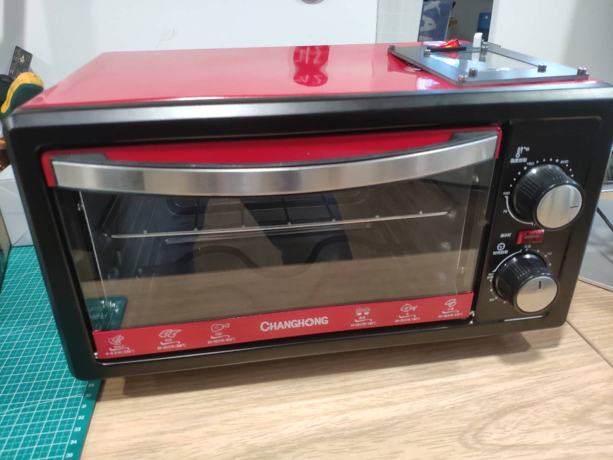

## 迷你回流焊炉 (μReflow Oven with MicroPython & LittlevGL)

See [here](./readme.md) for English version.

更新了！现在迷你回流焊炉使用PID来进行温度控制


老版本存放于branch ```Adafruit-EZ-Make-Oven-alike```。

本项目是在[Adafruit EZ Make Oven](https://learn.adafruit.com/ez-make-oven?view=all)的基础上改良和重度重写而来，
EZ Make Oven的源代码[在此](https://github.com/adafruit/Adafruit_Learning_System_Guides/tree/master/PyPortal_EZ_Make_Oven)。



本项目的目的是利用一些常见且廉价的硬件对一个普通的家用小烤箱进行改装，最终得到一个实用的回流焊炉，从而方便DIY电子制作。


本项目的用户界面通过LittlevGL ([lv_binding_micropython][lv]) 制作，这是一个功能强大又简单易用的图形界面库。
LittlevGL自带了ILI9341 TFT屏幕和XPT2046触控驱动，本项目正是利用了带触控的ILI9341屏来方便用户的使用。


### 物料清单
* 1 x 容积10-12升的家用小烤箱，例如[这个][oven]；
* 1 x 10安倍的固态继电器，例如[这个][ssr]；
* 1 x 无源压电蜂鸣器，例如[这个][buzzer]；
* 1 x 带XPT2046触控芯片的ILI9341 TFT显示屏，例如[这个][tft]；
* 1 x MAX31855控制板，以及K型热电偶，例如[这个][thermocouple]；
* 1 x 交流转直流5v的电源，用来给ESP32供电， 例如[这个][acdc]；
* 1 x ESP32开发板，例如[这个][esp32]。

### 烤箱改装及接线
* 警告: 220V市电若操作不当可能会造成人身伤害，甚至可能致命，确保在改装前把烤箱插头拔掉，切勿带电操作。
* 不同型号的烤箱，其内部结构可能不同，但总体原理大同小异：你需要绕开原烤箱的温控及定时器，让固态继电器来
控制加热管，这样ESP32就可以通过通断固态继电器来控制烤箱的加热。

### 给ESP32刷入固件
* 请参考[这篇](./FIRMWARE/readme.md)。

### 配置文件
* 通过编辑 ```config.json``` 文件来进行配置。
* 硬件接线: 修改以‘_pins’结尾的键值，使其与你实际的接线相符。
* TFT屏幕与触摸控制器共享 ```Clock```， ```Data In``` 及 ```Data Out``` 接口，并联即可。
* 配置文件中的ACC pin是用来给TFT屏幕供电的。
* ```sampling_hz``` 决定了温度传感器和PID算法的刷新率，及每秒刷新几次。
* ```temp_offset``` 和 ```pid``` 的参数可以在图形界面中进行设置修改。
* ```advanced_temp_tuning``` 只能通过编辑 ```config.json``` 进行修改。
    * ```preheat_until``` (摄氏度) 用于设置一个温度，在炉子达到该温度前，炉子的加热会一直开启，并忽略PID温控。这有助于在
    刚开始时炉子快速升温。
    * ```provisioning```  (秒) 用于PID算法预知将要到达的温度：由于回流焊的温度不是恒温，而是一个动态变化的温度曲线，设置这么
    一个参数有助于提高PID反应。
    * ```overshoot_comp``` (摄氏度) 用于降低温度过冲。
    
### 微调
* 上述 ```advanced_temp_tuning``` 参数可能需要多次试错才能达到满意的结果。为了方便这一过程，ESP32控制板在启动后会开启一个WiFi
 热点，名为 ```uReflow Oven ftp://192.168.4.1```
* 只需用电脑联上该热点，然后用FTP客户端（如：```FileZilla```）连到ftp://192.168.4.1:21 即可编辑修改```config.json```

### 安装程序
* 所需的文件均在 ```MAIN``` 目录下。
* 在刷完固件后，你需要先对```config.json```进行编辑，确保各个GPIO端口号与你实际接线相符。
* 将```MAIN```目录下所有文件及文件夹上传至ESP32开发板中。

### 使用说明
* 首次通电，程序会引导你进行屏幕校准，按照屏幕提示操作即可，结束后ESP32开发板
会重启。
* 在校准并重启后，用户界面会加载，通过下拉菜单，你可以选择不同的焊锡膏，确保你选择的焊锡膏类型与你实际
使用的型号相符。在选择焊锡膏后，屏幕下方会显示该焊锡膏的工作温度及整个回流焊的温度变化曲线。
* 如果你要使用的焊锡膏类型不在下拉菜单里，你也可以创建自己的焊锡膏类型文件，具体请参考：
https://learn.adafruit.com/ez-make-oven?view=all#the-toaster-oven，步骤在"Solder Paste Profiles"章节下。
新创建的焊锡膏文件需上传至ESP32中的```profiles```目录内。
* 全部准备就绪后，点击"Start"按钮就可以开始回流焊流程。
* 如果你想要再次校准屏幕，可以点击屏幕上的"Settings"按钮，然后在弹窗中选择屏幕校准选项。

[lv]:https://github.com/littlevgl/lv_binding_micropython
[oven]:https://www.aliexpress.com/item/4000151934943.html
[ssr]:https://www.aliexpress.com/item/4000083560440.html
[buzzer]:https://www.aliexpress.com/item/32808743801.html
[tft]:https://www.aliexpress.com/item/32960934541.html
[thermocouple]:https://www.aliexpress.com/item/32878757344.html
[acdc]:https://www.aliexpress.com/item/32821770958.html
[esp32]:https://www.aliexpress.com/item/32855652152.html